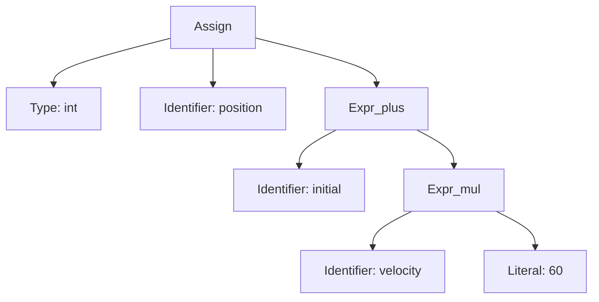

# Simulacion de Compilador

Programa de entrada:
`int position = initial + velocity * 60;`

## Fase 1: Analisis Lexico
Tabla de tokens y tabla de simbolos.

### Tabla de tokens:
| Lexema   | Token                 | Atributo/Entrada |
|----------|-----------------------|------------------|
| int      | KEYWORD_INT           | -                |
| position | IDENTIFIER            | id#1             |
| =        | ASSIGN                | -                |
| initial  | IDENTIFIER            | id#2             |
| +        | PLUS                  | -                |
| velocity | IDENTIFIER            | id#3             |
| *        | MULTIPLY              | -                |
| 60       | INTEGER_LITERAL       | 60               |
| ;        | SEMICOLON             | -                |

### Tabla de simbolos:
| Entrada | Identificador | Tipo | Ambito |
|---------|----------------|------|--------|
| id#1    | position       | int  | global |
| id#2    | initial        | int  | global |
| id#3    | velocity       | int  | global |

## Fase 2: Analisis Sintactico (AST)
### Arbol de sintaxis abstracta:




## Fase 3: Analisis Semantico
### Comprobaciones realizadas:
1) Declaracion: `position` declarado con tipo int.
2) Uso de identificadores: `initial` y `velocity` existen en la tabla de simbolos.
3) Compatibilidad de tipos: `int + (int * int) -> int`.
4) Asignacion: tipo de RHS `(int)` compatible con LHS `(int)`.
5) Ambito: todos los identificadores resuelven en el `ámbito global`.

## Fase 4: Codigo Intermedio (TAC)
```
t1 = velocity * 60
t2 = initial + t1
position = t2
```

## Fase 5: Codigo Maquina (ensamblador generico)
*Se asume que ya existen las variables en memoria y los registros R1, R2, R3*
```
- LOAD R1, velocity
- MULI R1, 60
- LOAD R2, initial
- ADD R2, R1
- STORE position, R2
```

## Fase 6: Optimizacion de Codigo
Optimizacion aplicada: Reutilizacion de registros y eliminacion de temporales.

### Codigo optimizado:
```
- LOAD R1, velocity
- MULI R1, 60
- ADD R1, initial
- STORE position, R1
```

**Descripción de la optimización**: Se elimina el temporal `t2` y el uso de `R2` ya que el resultado se mantiene en `R1`.


